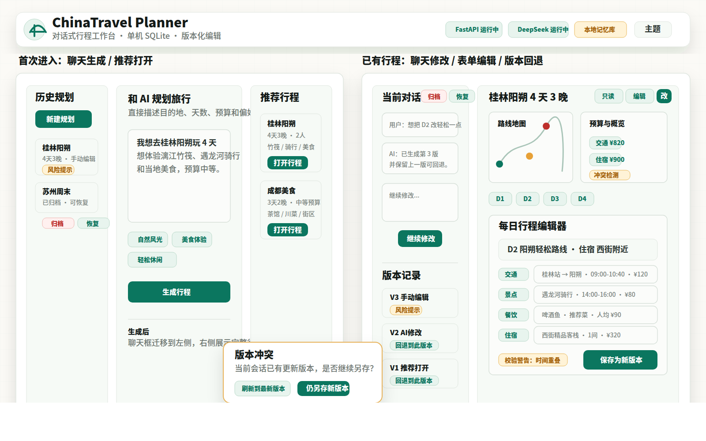

# Conversational Versioned Travel Planner Implementation Plan

> **For agentic workers:** REQUIRED SUB-SKILL: Use superpowers:subagent-driven-development (recommended) or superpowers:executing-plans to implement this plan task-by-task. Steps use checkbox (`- [ ]`) syntax for tracking.

**Goal:** 将 ChinaTravel 前端改成“首次聊天生成 / 已有行程工作台”两种状态，并新增 SQLite 持久化的对话、行程版本、推荐行程和回退能力。

**Architecture:** 保留现有 `POST /api/plan` 合同，新增独立的 `travel_memory` 持久化层和 conversation API。前端使用 Vue 单页状态机管理 `empty_chat` 与 `plan_workspace` 两种工作状态，右侧行程详情复用现有地图、预算、日程渲染能力，所有历史、推荐、版本回退通过后端 API 驱动。

**Tech Stack:** FastAPI, Pydantic v2, Python stdlib `sqlite3`, Vue 3, TypeScript, Vite, Element Plus, lucide-vue-next, pytest, vue-tsc.

---

## Important Notes

- 当前仓库已经存在未跟踪的 `travel_memory.sqlite`，其中有 `trip_requests`、`trip_plans`、`trip_feedback`、`route_stats`、`search_cache`。这些表偏向请求去重、推荐统计和反馈，不包含本次需要的对话线程、消息序列和版本回退结构。实现时应在同一个库中增量建表，不删除现有表。
- 默认不做用户登录，不做云同步；历史记录是单用户、单机、本地 SQLite 历史。
- 默认回退不会覆盖或删除历史版本，而是创建一个新的 `rollback` 版本。
- 编辑模式同时支持“自然语言修改当前行程”和“用户通过每日行程表单直接编辑结构化字段”。两种编辑保存后都必须创建新版本，不允许原地覆盖旧版本。
- 会话删除使用隐式删除：用户删除后进入可还原归档，不物理删除 SQLite 数据。
- 直接编辑保存前执行基础校验；校验失败时弹窗二次确认，用户确认后仍可保存新版本。
- 点击推荐行程后立即创建本地 conversation 和首个 `recommended` 版本，方便继续聊天修改与版本回退。
- 保留旧的 `trip_requests`、`trip_plans`、`trip_feedback`、`route_stats`、`search_cache`，新增表只做增量扩展，不做破坏性迁移。
- 实施前建议先安装完整运行依赖：`python -m pip install -r requirements.txt`。当前环境中 `geopy` 缺失会导致部分现有 SQLite 数据库测试在收集阶段失败。

## Confirmed Product Decisions

- 单用户单机：本阶段不做账号体系、权限隔离、多用户并发协作。
- 本地存储：只写本地 SQLite，不接云数据库或云同步。
- 直接编辑：允许用户用表单化的每日行程编辑器直接修改结构化字段；保存时创建 `manual_edit` 新版本。
- 删除还原：会话删除是软删除/归档，用户可以从归档入口恢复。
- 校验策略：手动编辑保存前做基础校验；校验失败时弹窗说明风险，用户二次确认后仍可保存版本。
- 推荐打开：点击推荐行程立即创建 conversation，后续所有聊天和编辑都绑定该会话。
- 兼容旧表：保留现有 request/plan/stat/cache 表，作为推荐 fallback 和历史兼容数据。

## Constraints And Boundaries

- Version immutability: `plan_versions.plan_json` 是不可变快照。AI 修改、直接编辑、回退都创建新版本；历史版本只读。
- Chat indexing: `conversation_messages` 用 `conversation_id + sequence` 做稳定排序，UI 不依赖创建时间排序消息。
- SQLite scope: 使用一个本地 SQLite 文件；API 写操作需要短事务，避免生成规划的长耗时过程持有数据库锁。
- Planner latency: 首版生成仍可能耗时较长；创建用户消息后再调用 planner，生成完成后补 assistant 消息和版本。失败时保留用户消息并返回业务错误。
- Direct edit validation: 直接编辑只接受完整 `TravelPlan` JSON 对象；后端做基础 JSON/object 校验和版本保存，不在第一版实现复杂行程语义校验。
- Direct edit UI: 不使用 JSON textarea 面向用户；前端提供每日行程表单编辑器，并在提交时组装完整 `TravelPlan` 对象。
- Validation override: 校验失败时默认阻止保存；用户在确认弹窗中选择继续后，后端以 `validation_override = true` 保存 `manual_edit` 版本，并记录校验警告。
- Validation risk marker: 带校验警告保存的版本必须在版本时间线和行程工具栏显示风险标记，方便用户后续识别。
- Soft delete: 删除 conversation 只把 `status` 改为 `archived`，列表默认隐藏；恢复时改回 `active`。
- Conflict detection: 手动编辑保存和 AI 修改提交时必须带上用户当前看到的 `base_version_id`。如果服务端当前版本已变化，返回冲突错误，由前端提示用户刷新或仍基于当前内容另存新版本。
- Recommendation opening: 推荐卡片点击即入库；如果用户误点，可通过隐式删除归档，之后也能恢复。
- Privacy: 单机数据库会保存用户聊天文本和完整行程 JSON；不做脱敏、不做加密，文档需明确这是本地开发/单机产品边界。
- Compatibility: 不修改现有 `POST /api/plan` 请求/响应合同，旧前端合同测试仍应通过或被明确替换为新版合同。
- FTS fallback: FTS5 可用时启用全文检索；不可用时降级为 `LIKE`，搜索能力变弱但功能不失败。

## File Structure

- Create `app/travel_memory.py`: SQLite schema 初始化、连接配置、conversation/message/version/recommendation CRUD。
- Modify `app/schemas.py`: 增加 Conversation、Message、PlanVersion、Recommendation、PlanRevision 请求/响应模型。
- Modify `app/main.py`: 注册 conversation、version restore、recommended plans API。
- Modify `app/assistants.py`: 增加基于 DeepSeek 的“按用户修改意图重写完整 plan JSON”辅助函数。
- Modify `frontend/src/services/planner.ts`: 增加 conversation/recommendation API 类型和请求函数。
- Create `frontend/src/components/ConversationSidebar.vue`: 左侧历史会话列表。
- Create `frontend/src/components/TravelChatPanel.vue`: 中间/左侧聊天面板。
- Create `frontend/src/components/RecommendedPlans.vue`: 初始状态右侧推荐行程。
- Create `frontend/src/components/PlanVersionTimeline.vue`: 行程状态版本列表和回退入口。
- Create `frontend/src/components/PlanWorkspace.vue`: 行程状态右侧只读/编辑工作区。
- Create `frontend/src/components/DailyItineraryEditor.vue`: 表单化每日行程编辑器，保存后创建 `manual_edit` 新版本。
- Modify `frontend/src/components/PlannerResults.vue`: 保留现有结果渲染，但允许接收已经存在的 `PlanResponse`，减少对生成中状态的耦合。
- Modify `frontend/src/App.vue`: 顶层状态机、数据加载、API orchestration。
- Modify `frontend/src/styles.css`: 新增双状态工作台布局、聊天、推荐、版本、编辑模式样式。
- Modify `README.md` and `.env.example`: 记录 memory DB 路径、API 和工作流。
- Test `tests/test_travel_memory.py`: SQLite schema 与 repository 行为。
- Test `tests/test_conversation_api.py`: 新 API 合同。
- Modify `tests/test_frontend_contract.py`: 前端组件与 UI 文案合同。

## Task 1: Persist This Plan Document

**Files:**
- Create: `docs/superpowers/plans/2026-05-15-conversational-versioned-travel-planner.md`

- [ ] **Step 1: Save the implementation plan**

Write this document to `docs/superpowers/plans/2026-05-15-conversational-versioned-travel-planner.md`.

- [ ] **Step 2: Verify the file exists**

Run:

```bash
test -f docs/superpowers/plans/2026-05-15-conversational-versioned-travel-planner.md
```

Expected: exit code `0`.

## Task 2: Backend Memory Tests

**Files:**
- Create: `tests/test_travel_memory.py`
- Create: `tests/test_conversation_api.py`

- [ ] **Step 1: Add repository tests**

Create tests that verify:

- `TravelMemoryStore.initialize()` creates `conversations`, `conversation_messages`, `plan_versions`, and key indexes.
- `create_conversation()` creates an empty conversation with `current_version_id = null`.
- `append_message()` increments `sequence` per conversation.
- `create_plan_version()` assigns version numbers `1, 2, 3...`, stores full `plan_json`, and updates `conversations.current_version_id`.
- `restore_version()` creates a new version with `source = "rollback"` and `parent_version_id` pointing to the restored version.
- `recommended_plans()` first returns versioned plans, then falls back to existing `trip_plans`, then falls back to static examples.

- [ ] **Step 2: Add API tests**

Create tests that verify:

- `GET /api/conversations` returns a list with newest updated conversations first.
- `GET /api/conversations/{id}` returns messages, versions, and current plan.
- `POST /api/conversations` creates a conversation from an initial user message.
- `POST /api/conversations/{id}/messages` stores the user message and, when mocked planner succeeds, stores an assistant message plus version.
- `POST /api/conversations/{id}/manual-edits` stores a directly edited complete plan as a `manual_edit` version.
- `POST /api/conversations/{id}/versions/{version_id}/restore` creates a rollback version and does not delete older versions.
- `GET /api/recommended-plans` returns cards suitable for the first screen.

- [ ] **Step 3: Run tests and confirm RED**

Run:

```bash
python -m pytest tests/test_travel_memory.py tests/test_conversation_api.py -q
```

Expected before implementation: failures because `app.travel_memory` and new API routes do not exist.

## Task 3: SQLite Memory Store

**Files:**
- Create: `app/travel_memory.py`
- Modify: `tests/conftest.py`

- [ ] **Step 1: Add environment isolation**

Extend `PRODUCT_ENV_VARS` in `tests/conftest.py` with:

```python
"CHINATRAVEL_MEMORY_DB_PATH",
```

This lets tests point memory storage at a temporary SQLite file.

- [ ] **Step 2: Implement database path resolution**

In `app/travel_memory.py`, implement:

```python
DEFAULT_MEMORY_DB_PATH = PROJECT_ROOT / "travel_memory.sqlite"

def get_memory_db_path() -> Path:
    configured = get_env_value("CHINATRAVEL_MEMORY_DB_PATH")
    if configured:
        return Path(configured).expanduser().resolve()
    return DEFAULT_MEMORY_DB_PATH
```

- [ ] **Step 3: Implement schema initialization**

Create these tables if missing:

```sql
CREATE TABLE IF NOT EXISTS conversations (
  id TEXT PRIMARY KEY,
  title TEXT NOT NULL,
  status TEXT NOT NULL DEFAULT 'active',
  current_version_id TEXT,
  created_at TEXT NOT NULL,
  updated_at TEXT NOT NULL
);

CREATE TABLE IF NOT EXISTS conversation_messages (
  id TEXT PRIMARY KEY,
  conversation_id TEXT NOT NULL,
  sequence INTEGER NOT NULL,
  role TEXT NOT NULL CHECK(role IN ('user', 'assistant', 'system')),
  content TEXT NOT NULL,
  plan_version_id TEXT,
  request_id TEXT,
  created_at TEXT NOT NULL,
  FOREIGN KEY(conversation_id) REFERENCES conversations(id),
  FOREIGN KEY(plan_version_id) REFERENCES plan_versions(id),
  UNIQUE(conversation_id, sequence)
);

CREATE TABLE IF NOT EXISTS plan_versions (
  id TEXT PRIMARY KEY,
  conversation_id TEXT NOT NULL,
  version_number INTEGER NOT NULL,
  parent_version_id TEXT,
  source TEXT NOT NULL CHECK(source IN ('ai_generated', 'ai_edit', 'manual_edit', 'rollback', 'recommended')),
  plan_json TEXT NOT NULL,
  summary TEXT,
  total_cost REAL,
  request_id TEXT,
  created_at TEXT NOT NULL,
  FOREIGN KEY(conversation_id) REFERENCES conversations(id),
  FOREIGN KEY(parent_version_id) REFERENCES plan_versions(id),
  UNIQUE(conversation_id, version_number)
);

CREATE INDEX IF NOT EXISTS idx_conversations_updated_at ON conversations(updated_at DESC);
CREATE INDEX IF NOT EXISTS idx_conversation_messages_thread ON conversation_messages(conversation_id, sequence);
CREATE INDEX IF NOT EXISTS idx_plan_versions_thread ON plan_versions(conversation_id, version_number DESC);
```

Attempt to create optional FTS5:

```sql
CREATE VIRTUAL TABLE IF NOT EXISTS conversation_messages_fts
USING fts5(content, conversation_id UNINDEXED, message_id UNINDEXED);
```

If FTS5 is unavailable, catch `sqlite3.OperationalError` and continue with `LIKE` search support.

- [ ] **Step 4: Implement repository methods**

Implement `TravelMemoryStore` methods:

- `initialize()`
- `create_conversation(title: str | None = None) -> dict`
- `list_conversations(limit: int = 30, include_archived: bool = False) -> list[dict]`
- `get_conversation(conversation_id: str) -> dict | None`
- `archive_conversation(conversation_id: str) -> dict`
- `restore_conversation(conversation_id: str) -> dict`
- `append_message(conversation_id: str, role: str, content: str, plan_version_id: str | None = None, request_id: str | None = None) -> dict`
- `create_plan_version(conversation_id: str, plan: dict, source: str, parent_version_id: str | None = None, request_id: str | None = None, summary: str | None = None) -> dict`
- `restore_version(conversation_id: str, version_id: str) -> dict`
- `recommended_plans(limit: int = 6) -> list[dict]`

- [ ] **Step 5: Run repository tests**

Run:

```bash
python -m pytest tests/test_travel_memory.py -q
```

Expected after implementation: all tests in this file pass.

## Task 4: Backend Schemas And APIs

**Files:**
- Modify: `app/schemas.py`
- Modify: `app/main.py`
- Modify: `app/assistants.py`
- Test: `tests/test_conversation_api.py`

- [ ] **Step 1: Add Pydantic models**

Add models with these stable names:

- `ConversationCreateRequest`: `message: str`
- `ConversationMessageRequest`: `message: str`, optional `base_version_id: str`, `conflict_override: bool = False`
- `PlanManualEditRequest`: `plan: dict`, `base_version_id: str`, optional `note: str`, `validation_override: bool = False`, `conflict_override: bool = False`
- `ConversationSummary`: `id`, `title`, `status`, `current_version_id`, `updated_at`, optional `current_plan_summary`
- `ConversationMessage`: `id`, `conversation_id`, `sequence`, `role`, `content`, `plan_version_id`, `request_id`, `created_at`
- `PlanVersionSummary`: `id`, `conversation_id`, `version_number`, `parent_version_id`, `source`, `summary`, `total_cost`, `request_id`, `created_at`
- `ConversationDetailResponse`: `success`, `conversation`, `messages`, `versions`, `current_plan`, optional `error`
- `ConversationListResponse`: `success`, `conversations`, optional `error`
- `ConversationMessageResponse`: `success`, `conversation`, `message`, `assistant_message`, `version`, `current_plan`, optional `error`
- `RecommendationItem`: `id`, `title`, `summary`, `plan`, `source`, optional `conversation_id`, optional `version_id`
- `RecommendedPlansResponse`: `success`, `recommendations`, optional `error`

- [ ] **Step 2: Add DeepSeek plan revision helper**

In `app/assistants.py`, add `revise_plan_with_chat(current_plan: dict, recent_messages: list[dict], user_message: str) -> dict`.

The helper should prompt DeepSeek to return a complete JSON object preserving the existing travel plan shape. It must parse JSON with `_loads_mixed_json`, validate that the result is a dict, and raise `ValueError` if parsing fails.

- [ ] **Step 3: Register routes**

In `app/main.py`, initialize one `TravelMemoryStore` and add:

- `GET /api/conversations`
- `POST /api/conversations`
- `GET /api/conversations/{conversation_id}`
- `POST /api/conversations/{conversation_id}/archive`
- `POST /api/conversations/{conversation_id}/restore`
- `POST /api/conversations/{conversation_id}/messages`
- `POST /api/conversations/{conversation_id}/manual-edits`
- `POST /api/conversations/{conversation_id}/versions/{version_id}/restore`
- `GET /api/recommended-plans`

Behavior:

- New conversation stores the initial user message and returns detail.
- If a conversation has no current plan, posting a message calls existing planner through `get_planner().plan(PlanRequest(query=message))`.
- If a conversation has a current plan, posting a message calls `revise_plan_with_chat()` and stores a new `ai_edit` version. If `base_version_id` is stale and `conflict_override` is false, return a conflict business error before calling the LLM.
- Assistant messages should be short Chinese summaries, for example `已生成第 1 版行程。` or `已根据你的要求生成第 2 版行程。`
- Direct edit endpoint accepts a full plan object from the form editor, validates required top-level fields and itinerary day/activity structure, checks `base_version_id`, stores a `manual_edit` version, and appends an assistant message such as `已保存你手动编辑的第 3 版行程。`
- If `base_version_id` is stale and `conflict_override` is false, return `VERSION_CONFLICT` with the server current version summary. If `conflict_override` is true, save a new version whose parent is the current server version and include conflict metadata.
- If direct edit validation fails and `validation_override` is false, return a business error with validation warnings. If `validation_override` is true, save the version and include warnings in version metadata.
- Archive/restore endpoints flip conversation status between `archived` and `active`; they never delete messages or versions.
- Restore creates a rollback version and assistant message, then returns updated detail.

- [ ] **Step 4: Run API tests**

Run:

```bash
python -m pytest tests/test_conversation_api.py -q
```

Expected after implementation: all conversation API tests pass.

## Task 5: Frontend Contract Tests

**Files:**
- Modify: `tests/test_frontend_contract.py`

- [ ] **Step 1: Add frontend contract expectations**

Extend existing frontend contract tests to require:

- `ConversationSidebar.vue`
- `TravelChatPanel.vue`
- `RecommendedPlans.vue`
- `PlanVersionTimeline.vue`
- `PlanWorkspace.vue`
- `DailyItineraryEditor.vue`
- `empty_chat`
- `plan_workspace`
- `requestConversations`
- `requestConversationDetail`
- `sendConversationMessage`
- `restorePlanVersion`
- `saveManualPlanEdit`
- `archiveConversation`
- `restoreConversation`
- `requestRecommendedPlans`
- Chinese UI copy: `历史规划`, `推荐行程`, `继续修改`, `只读`, `编辑`, `直接编辑`, `保存为新版本`, `版本记录`, `回退到此版本`, `归档`, `恢复`

- [ ] **Step 2: Run frontend contract tests and confirm RED**

Run:

```bash
python -m pytest tests/test_frontend_contract.py -q
```

Expected before frontend implementation: failures because new components and service functions do not exist.

## Task 6: Frontend Service Layer

**Files:**
- Modify: `frontend/src/services/planner.ts`

- [ ] **Step 1: Add TypeScript types**

Add:

- `ConversationSummary`
- `ConversationMessage`
- `PlanVersionSummary`
- `ConversationDetailResponse`
- `ConversationListResponse`
- `ConversationMessageResponse`
- `RecommendationItem`
- `RecommendedPlansResponse`

- [ ] **Step 2: Add request helpers**

Add functions:

- `requestConversations(): Promise<ConversationListResponse>`
- `createConversation(message: string): Promise<ConversationDetailResponse>`
- `requestConversationDetail(id: string): Promise<ConversationDetailResponse>`
- `sendConversationMessage(id: string, message: string): Promise<ConversationMessageResponse>`
- `restorePlanVersion(conversationId: string, versionId: string): Promise<ConversationDetailResponse>`
- `saveManualPlanEdit(conversationId: string, plan: TravelPlan, baseVersionId: string, note?: string, validationOverride?: boolean, conflictOverride?: boolean): Promise<ConversationDetailResponse>`
- `archiveConversation(conversationId: string): Promise<ConversationDetailResponse>`
- `restoreConversation(conversationId: string): Promise<ConversationDetailResponse>`
- `requestRecommendedPlans(): Promise<RecommendedPlansResponse>`

Each helper should follow the existing fetch style and return business errors rather than throwing for non-OK API responses.

- [ ] **Step 3: Run TypeScript build**

Run:

```bash
npm run build
```

Expected: build may still fail until UI components are wired, but `planner.ts` types should compile once imports are updated.

## Task 7: Frontend Components

**Files:**
- Create: `frontend/src/components/ConversationSidebar.vue`
- Create: `frontend/src/components/TravelChatPanel.vue`
- Create: `frontend/src/components/RecommendedPlans.vue`
- Create: `frontend/src/components/PlanVersionTimeline.vue`
- Create: `frontend/src/components/PlanWorkspace.vue`
- Create: `frontend/src/components/DailyItineraryEditor.vue`
- Modify: `frontend/src/components/PlannerResults.vue`
- Modify: `frontend/src/App.vue`
- Modify: `frontend/src/styles.css`

- [ ] **Step 1: Build `ConversationSidebar.vue`**

Responsibilities:

- Render `历史规划` list.
- Show title, updated time, and current plan summary when present.
- Emit `select-conversation`.
- Include a `新建规划` action that returns the app to `empty_chat`.
- Include `归档` on active conversations and an archived view with `恢复`.

- [ ] **Step 2: Build `TravelChatPanel.vue`**

Responsibilities:

- Render user/assistant message bubbles in sequence order.
- Provide textarea input and primary submit button.
- In initial state, headline should invite the user to describe travel needs.
- In plan state, submit copy should be `继续修改`.
- Emit `send-message`.

- [ ] **Step 3: Build `RecommendedPlans.vue`**

Responsibilities:

- Render `推荐行程` cards from API.
- Cards show title, summary, source label, destination/days when available.
- Emit `select-recommendation`.

- [ ] **Step 4: Build `PlanVersionTimeline.vue`**

Responsibilities:

- Render `版本记录`.
- Highlight current version.
- Show source, created time, summary.
- Provide `回退到此版本` button for non-current versions.
- Emit `restore-version`.

- [ ] **Step 5: Build `PlanWorkspace.vue`**

Responsibilities:

- Render mode switch: `只读` and `编辑`.
- In read mode, show the current plan using `PlannerResults`.
- In edit mode, show `TravelChatPanel` and `PlanVersionTimeline` beside the plan details.
- In direct edit mode, show `DailyItineraryEditor` with form controls for trip summary, days, and activities.
- Ensure chat edits and direct edits both create new versions through API; do not mutate older `TravelPlan` versions locally.

- [ ] **Step 6: Build `DailyItineraryEditor.vue`**

Responsibilities:

- Render summary fields: start city, destination, departure date, return date, days, people, budget, plan summary.
- Render day tabs/cards with editable day title, location, accommodation, and summary.
- Render activity rows with type-specific fields:
  - 交通：start, end, TrainID/transportation, start time, end time, duration, seat label, ticket count, cost.
  - 住宿：hotel/place, city, check-in time, check-out time, rooms, price, cost, notes.
  - 餐饮：restaurant/place, city, time range, recommended food, per-person price, cost, notes.
  - 景点/活动：title/place, city, time range, transport, ticket price/count, cost, notes.
- Allow add/remove/reorder activities within a day and add/remove days.
- Validate required fields before save and show inline warnings.
- If validation fails, show a confirmation modal; on confirm call `saveManualPlanEdit` with `validationOverride = true`.
- If conflict detection fails, show a conflict modal with `刷新到最新版本` and `仍另存新版本`.
- Submit a complete `TravelPlan` object through `saveManualPlanEdit`.
- Button copy: `保存为新版本`.
- Do not allow saving while request is pending.

- [ ] **Step 7: Refactor `PlannerResults.vue` only as needed**

Keep the existing route/map rendering. Add support for externally provided current plan responses without requiring `submittedPayload` or generation progress.

- [ ] **Step 8: Wire `App.vue` state machine**

Add:

```ts
type AppMode = "empty_chat" | "plan_workspace";
```

State rules:

- On mount, load conversations and recommendations.
- If no current conversation is selected, show `empty_chat`.
- Sending an initial chat creates or populates a conversation, then switches to `plan_workspace`.
- Selecting history opens that conversation and switches to `plan_workspace`.
- Selecting recommendation creates or opens a conversation with that plan and switches to `plan_workspace`.
- Restoring a version reloads conversation detail.
- Saving a direct edit reloads conversation detail and highlights the new `manual_edit` version.

- [ ] **Step 9: Style the workspace**

Use the existing refined travel operations desk style. Keep dense dashboard ergonomics:

- Initial state: 3 columns: history, chat, recommendations.
- Plan state: 2 columns: left chat/version rail, right plan workspace.
- Avoid nested cards and marketing hero layouts.
- Buttons use lucide icons where available.
- Ensure text does not overflow buttons on mobile and desktop.

## Task 8: Recommended Plan Selection

**Files:**
- Modify: `app/main.py`
- Modify: `app/travel_memory.py`
- Modify: `frontend/src/App.vue`

- [ ] **Step 1: Backend recommendation shape**

Make `GET /api/recommended-plans` return ready-to-render cards:

```json
{
  "success": true,
  "recommendations": [
    {
      "id": "sample-guilin-yangshuo",
      "title": "桂林阳朔 4 天 3 晚",
      "summary": "漓江竹筏、遇龙河骑行和当地美食。",
      "source": "sample",
      "plan": {
        "start_city": "上海",
        "target_city": "桂林、阳朔",
        "days": 4,
        "people_number": 2,
        "budget": 3400,
        "itinerary": []
      }
    }
  ]
}
```

- [ ] **Step 2: Selecting a recommendation**

When the user clicks a recommended plan, create a conversation with:

- One assistant message: `已打开推荐行程，可继续告诉我你想怎么调整。`
- One `plan_versions` row with `source = "recommended"`.
- Conversation title derived from recommendation title.

If this is implemented via a new API, name it:

```text
POST /api/recommended-plans/{recommendation_id}/open
```

Return the same shape as `ConversationDetailResponse`.

## UI Structure Specification

**Prototype Reference**



- PNG reference: `docs/assets/chinatravel-ui-prototype-reference.png`
- Editable SVG source: `docs/assets/chinatravel-ui-prototype-reference.svg`
- Notes: XLab successfully generated a simple image with the provided key, but repeated UI mockup prompts disconnected at the remote API layer. This reference image was produced locally as a deterministic SVG/PNG using the same `frontend-design` and `ui-ux-pro-max` constraints so implementation is not blocked.

**Visual Direction**

- The interface should remain a compact travel operations desk, not a marketing page: warm paper background, white/porcelain work surfaces, jade primary actions, cinnabar/amber warning accents, charcoal text, subtle map/grid motifs.
- Density should favor repeated planning work: short headers, sticky toolbars, scrollable panels, visible status, no oversized hero blocks.
- Cards are only used for repeated items such as history rows, recommendation cards, version rows, activity rows, and dialogs.

**Global Shell**

- Header remains at top with brand, runtime status chips, theme toggle, and compact utility actions.
- Main body has two app modes:
  - `empty_chat`: first visit or no selected conversation.
  - `plan_workspace`: selected/generated/recommended plan exists.
- Global notifications appear as slim inline banners under the header for API errors, validation warnings, restore/archive success, and planner failures.

**Empty Chat Mode**

- Desktop layout uses three columns:
  - Left `ConversationSidebar`: `历史规划`, `新建规划`, active conversations by updated time, archived toggle.
  - Center `TravelChatPanel`: prominent but work-focused chat composer for the initial travel request; sample prompt chips may sit below the input.
  - Right `RecommendedPlans`: `推荐行程` cards from API, each with destination, days, budget if available, source, and open action.
- Empty history state says there are no saved plans yet and keeps `新建规划` visible.
- Clicking a history item opens `plan_workspace`.
- Clicking a recommendation immediately creates a conversation and opens `plan_workspace`.

**Plan Workspace Mode**

- Desktop layout uses two major columns:
  - Left rail: current conversation chat at top, version timeline below, both scrollable within the rail.
  - Right workspace: plan detail, edit controls, map/route/details.
- The left rail header shows conversation title, status, and actions: `新建规划`, `归档`; archived conversations show `恢复`.
- Chat remains available after generation because AI edits are driven by conversation context.
- Version timeline shows version number, source label (`AI生成`, `AI修改`, `手动编辑`, `回退`, `推荐`), time, summary, and `回退到此版本` for non-current versions.

**Plan Workspace Right Panel**

- Top toolbar contains:
  - Mode segmented control: `只读`, `编辑`.
  - Secondary actions: export JSON, share/copy summary if already present, save state indicator.
  - Current version chip.
- Read mode uses the existing `PlannerResults` route/map/budget/day-detail experience.
- Edit mode splits the right panel into:
  - `AI修改` chat prompt area for natural-language changes.
  - `直接编辑` daily itinerary form.
  - Version panel remains visible in the left rail, not duplicated.

**Daily Itinerary Editor**

- Summary section:
  - Inputs for start city, destination cities, departure date, return date, days, people number, budget, plan summary.
  - Budget and people use numeric controls; dates use date pickers; destinations use a comma-separated text input for v1.
- Day editor:
  - Day tabs across the top: `D1`, `D2`, etc., with add day button.
  - Each day has fields for title, location, accommodation, day summary.
- Activity editor:
  - Activity rows are fixed-height rows with icon/type selector and type-specific field groups for transport, hotel, restaurant, and attraction/activity.
  - Row actions use icons: add, duplicate, move up/down, remove.
  - Removing an activity is local until the user saves the version.
- Save flow:
  - `保存为新版本` runs frontend validation.
  - Validation warnings are shown inline above the save button.
  - If warnings exist, confirmation dialog explains that the plan may be inconsistent and offers `返回修改` and `仍然保存`.
  - Confirming calls manual edit API with `validation_override = true`.
  - If the version is stale, conflict dialog explains that another version has been created and offers `刷新到最新版本` or `仍另存新版本`.
  - Versions saved with validation warnings show an amber risk badge in the version timeline and read-mode toolbar.

**Archive And Restore UI**

- `归档` is the user-facing delete action.
- Archived conversations are hidden from the default history list.
- The history sidebar has a compact archived filter/view; archived rows show `恢复`.
- Restoring returns the conversation to active history without changing versions.

**Responsive Behavior**

- Tablet and mobile collapse to stacked panels:
  - Top: mode tabs for `历史`, `聊天`, `行程`, `版本`.
  - Only one panel is visible at a time to avoid cramped columns.
  - Primary action remains sticky at bottom of the active panel.
- All buttons must keep text within bounds; long destination names truncate with title tooltip or wrap into at most two lines.
- Map/detail should stay usable on mobile by putting the map above day/activity detail with stable height.

## Task 9: Documentation

**Files:**
- Modify: `README.md`
- Modify: `.env.example`

- [ ] **Step 1: Document memory DB config**

Add to `.env.example`:

```env
# Local conversation, plan version, and recommendation memory database.
# Defaults to ./travel_memory.sqlite when unset.
CHINATRAVEL_MEMORY_DB_PATH=travel_memory.sqlite
```

- [ ] **Step 2: Document new API**

Add README section covering:

- `GET /api/conversations`
- `POST /api/conversations`
- `GET /api/conversations/{id}`
- `POST /api/conversations/{id}/archive`
- `POST /api/conversations/{id}/restore`
- `POST /api/conversations/{id}/messages`
- `POST /api/conversations/{id}/manual-edits`
- `POST /api/conversations/{id}/versions/{version_id}/restore`
- `GET /api/recommended-plans`

- [ ] **Step 3: Document storage model**

Explain:

- `conversation_messages` uses `conversation_id + sequence` for ordered chat display.
- `plan_versions` stores full immutable plan snapshots.
- Rollback creates a new version instead of rewriting history.
- Direct edits from the daily itinerary form create `manual_edit` versions instead of rewriting current plan JSON.
- Conversation delete/archive is soft delete through `status = archived`; restore flips it back to `active`.
- Existing `trip_plans` and `route_stats` are used as recommendation fallback data.

## Task 10: Verification

**Files:**
- No new files.

- [ ] **Step 1: Run focused backend tests**

Run:

```bash
python -m pytest tests/test_travel_memory.py tests/test_conversation_api.py -q
```

Expected: all focused backend tests pass.

- [ ] **Step 2: Run frontend contract tests**

Run:

```bash
python -m pytest tests/test_frontend_contract.py -q
```

Expected: all frontend contract tests pass.

- [ ] **Step 3: Run frontend build**

Run:

```bash
npm run build
```

Expected: Vite and `vue-tsc --noEmit` complete successfully.

- [ ] **Step 4: Run full Python tests**

Run:

```bash
python -m pytest -q
```

Expected: all tests pass in an environment with dependencies installed from `requirements.txt`. If collection fails with `ModuleNotFoundError: No module named 'geopy'`, install dependencies with `python -m pip install -r requirements.txt` and rerun.

## Remaining Questions And Edge Cases

- 表单化编辑已确定需要交通/住宿/餐饮/景点专用字段；第一版仍统一输出完整 `TravelPlan` JSON。
- 校验失败后的保存版本已确定需要 UI 风险标记；warnings 存入版本 metadata，并在版本时间线显示警告状态。
- 多标签页/旧版本编辑已确定加入冲突检测；用户可刷新到最新版本或确认另存新版本。
- 不做数据库级备份/导出入口；只保留行程 JSON 导出。
